# WheatherApp

A concise Swift/Xcode project that demonstrates modern Apple platform development.

## Overview

This repository contains an Xcode project built with Swift. It is structured to be easy to explore and extend, following current best practices for Apple platforms.

- Platform(s): iOS (and others as applicable)
- Language: Swift
- UI: SwiftUI (or UIKit where noted)
- Minimum OS: Update as needed
- Build system: Xcode 26+

## Screenshots

| View Name | Light Mode | Dark Mode |
|----------|-----------|-----------|
| Landing Page (List View) | 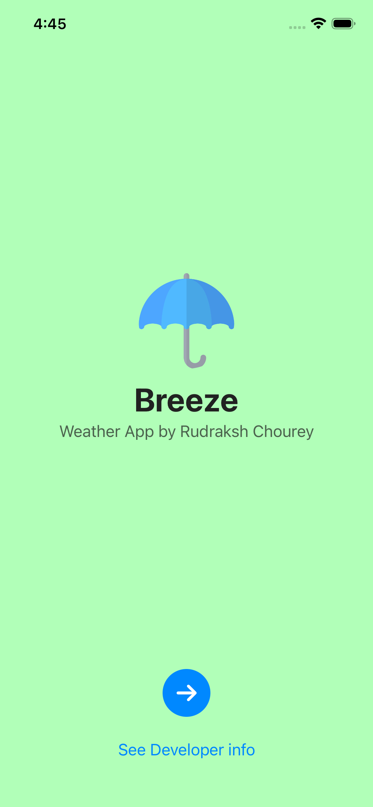 | 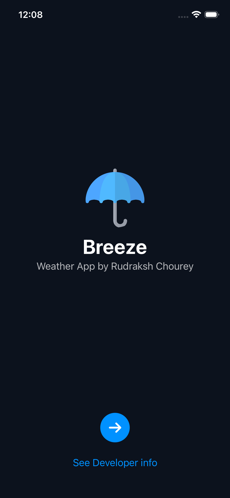 |
| ListView Page | 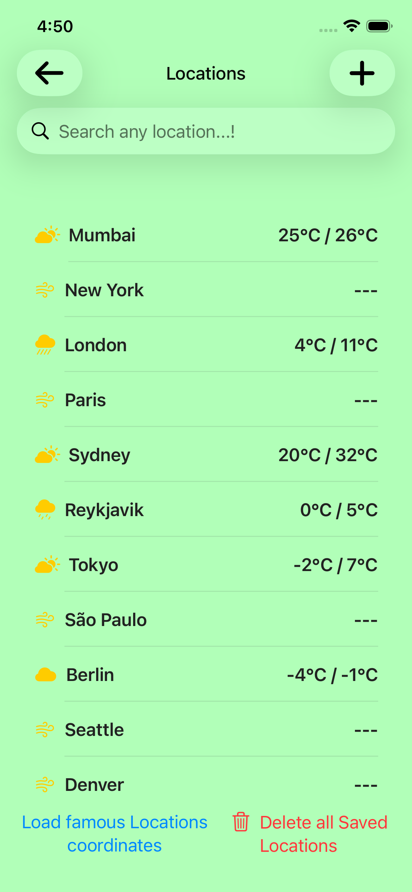 |  |
| Add Location Page | 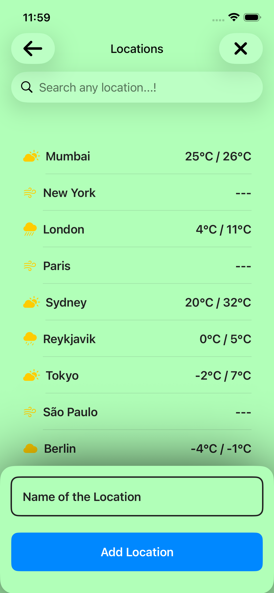 | 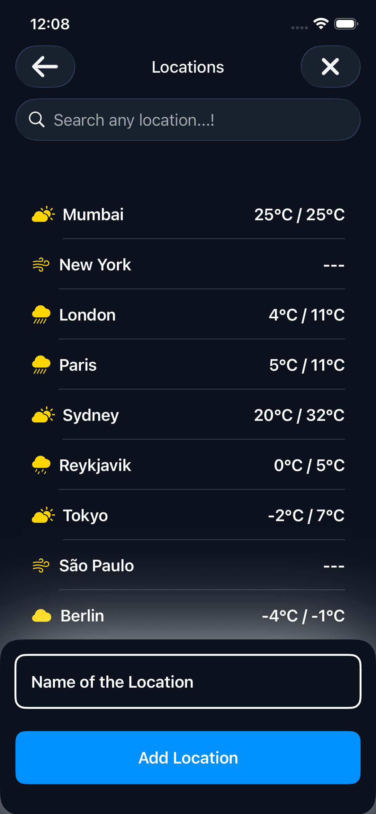 |
| Edit Location Page | 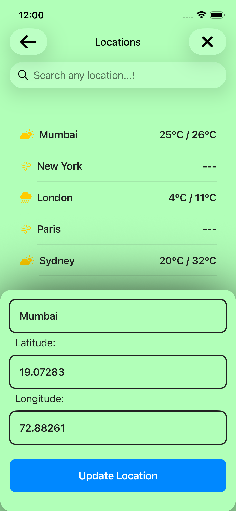 | 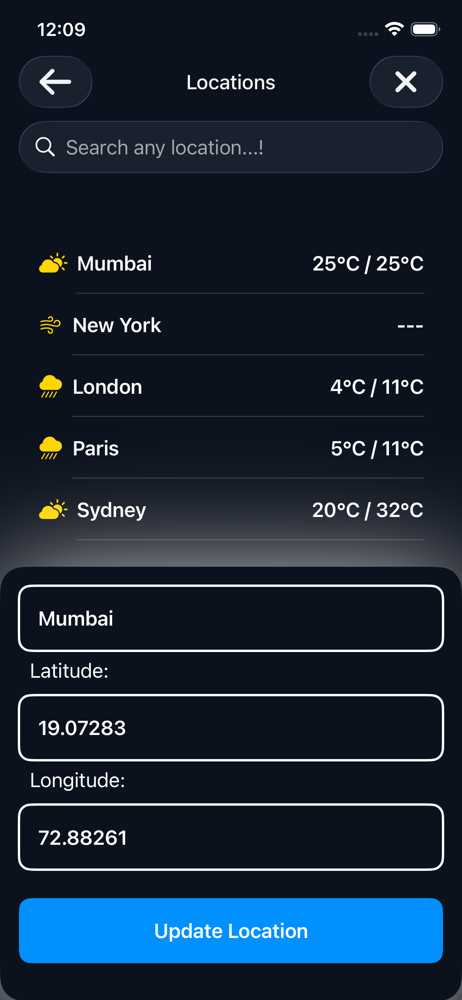 |
| Edge Delete | 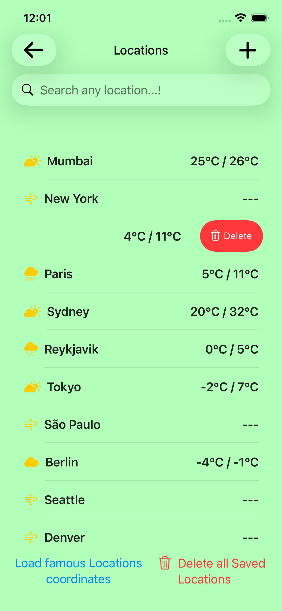 | 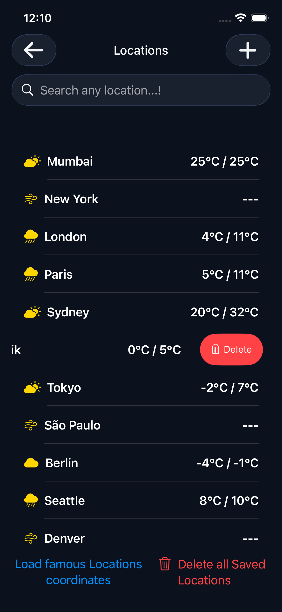 |
| Context Menu | 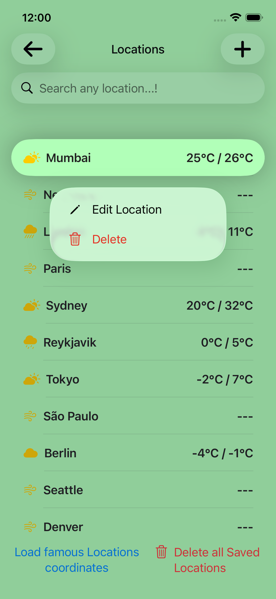 |  |
| Details View (Saved Data) | 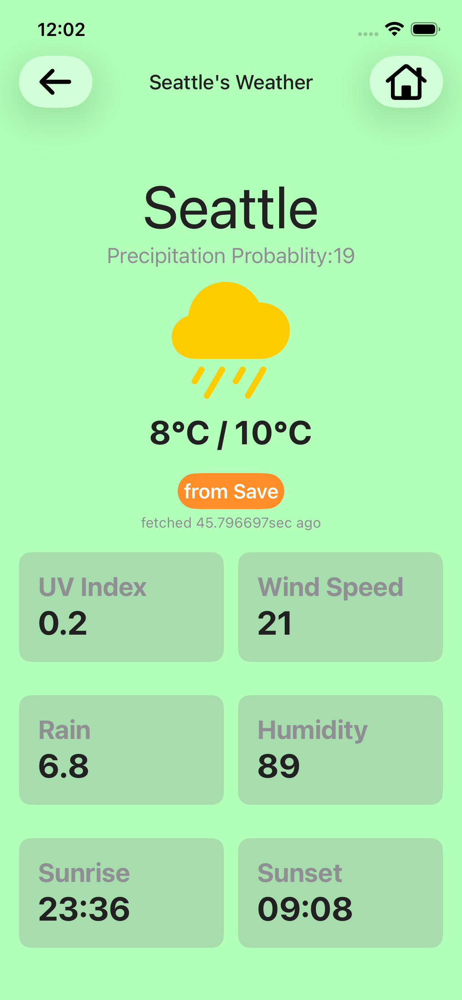 | 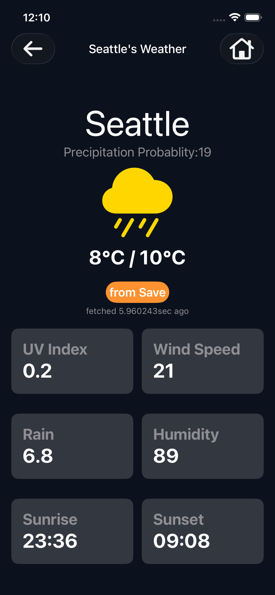 |
| Details View (Live API) |  | 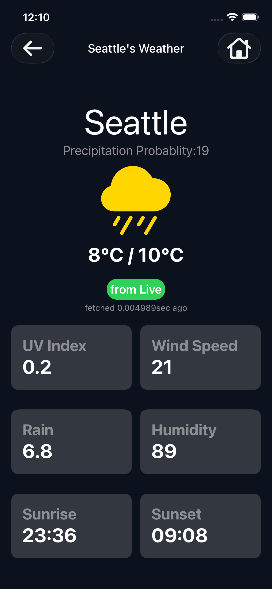 |

## Requirements

- Xcode 26.0 or later
- Swift 6.x
- iOS 17+ (adjust as needed)

 
